# Manual de Operación — Washouse

Guía del mostrador. Describe la aplicación tal como está hoy en `main`.

> Las capturas salieron de `scripts/capturas-manual.mjs`, corriendo la app con datos de
> demostración de la sucursal Vista Hermosa. Para regenerarlas: `npm run dev` y luego
> `node scripts/capturas-manual.mjs`.

- **Navegador:** Chrome o Edge. (La báscula USB usa Web Serial, que solo existe en esos dos.)
- **Internet:** obligatorio. La app guarda todo en Supabase en el momento; no funciona sin conexión.
- **Pop-ups:** deben estar permitidos en el sitio, porque los tickets se imprimen abriendo una ventana nueva.

---

## 1. Abrir turno

Al entrar, la app bloquea todo hasta que alguien se identifica.

1. **Identificación de Personal** — toca tu nombre en la lista y escribe tu **PIN de 4 dígitos**.
   - Si el PIN es de otro compañero, avisa: *"El PIN ingresado pertenece a otro usuario."*
   - Solo aparece el personal asignado a esta sucursal (o marcado como global).

   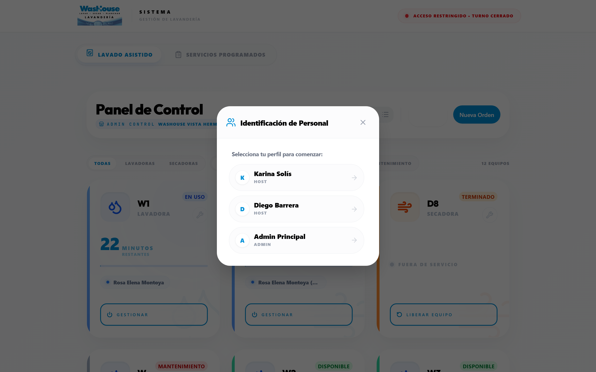

   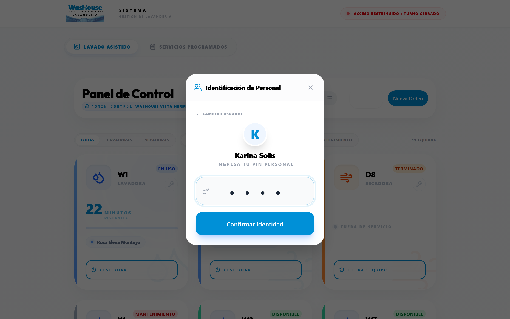

2. **Apertura de Caja** — captura el **fondo inicial en efectivo**, contado antes de la primera venta. Ese número es la base del corte; si lo capturas mal, el corte saldrá con diferencia.

   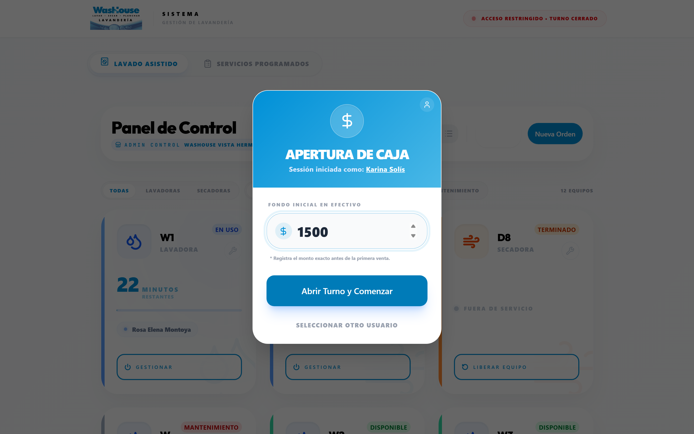

3. Arriba a la derecha queda el indicador verde **"En turno"** con tu nombre.

Mientras el turno esté cerrado, el sistema muestra "Acceso Restringido" y no deja operar máquinas ni crear órdenes.

---

## 2. Las dos pestañas

| Pestaña | Para qué |
|---|---|
| **Lavado Asistido** | Tablero de máquinas. Autoservicio y lavado que se procesa en el momento. |
| **Servicios Programados** | Órdenes que el cliente deja y recoge después (encargo, planchado, compostura). |

---

## 3. Lavado Asistido — el tablero de máquinas

Cada tarjeta es una lavadora o secadora. Se ordenan solas: primero las que necesitan atención (en uso, terminadas, en mantenimiento) y al final las disponibles.

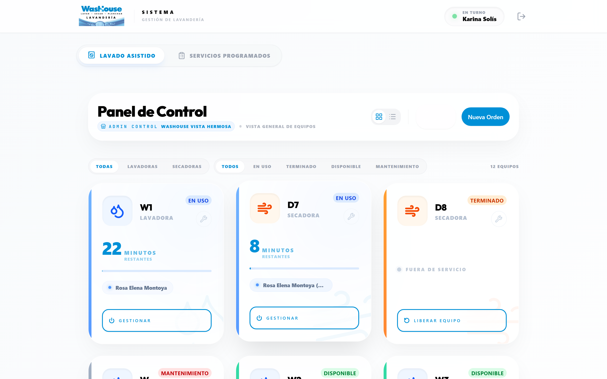

**Qué pasa al tocar una tarjeta, según su estado:**

| Estado | Botón de la tarjeta | Qué hace |
|---|---|---|
| **Disponible** | *Comenzar Ciclo* | Abre el asistente de nueva orden con esa máquina ya seleccionada. |
| **En uso** | *Gestionar* | Muestra el detalle de la orden. Ahí está el botón rojo **Forzar Terminado** por si el ciclo real acabó antes. |
| **Terminado** | *Liberar Equipo* | La deja disponible. Hazlo **solo cuando el cliente ya sacó su ropa.** |
| **Mantenimiento** | llave 🔧 | El ícono de llave de cada tarjeta la saca o la regresa a servicio. |

Otras herramientas de esta pantalla:

- **Filtros** por tipo (Lavadoras / Secadoras) y por estado.
- **Vista** compacta o amplia.
- **Inventario** — consulta y ajusta existencias de insumos de la sucursal.
- **Nueva Orden** — abre el asistente sin máquina asignada (queda como *Mostrador*).

**Duración de los ciclos:** los pone el sistema, no se capturan. 45 min si la orden incluye lavado, 30 min si no. Si la orden lleva secado y la máquina es lavadora, el sistema **arranca solo la secadora que le corresponde por posición** (la 1ª lavadora con la 1ª secadora, y así), siempre que esa secadora esté libre.

---

## 4. Nueva Orden — el asistente de 5 pasos

`Enter` avanza al siguiente paso. El botón **Atrás** regresa sin perder lo capturado.

### Paso 1 — Datos del Cliente
Nombre y teléfono, **los dos obligatorios**. El teléfono es el que se usa para el WhatsApp de aviso, escríbelo bien (10 dígitos).

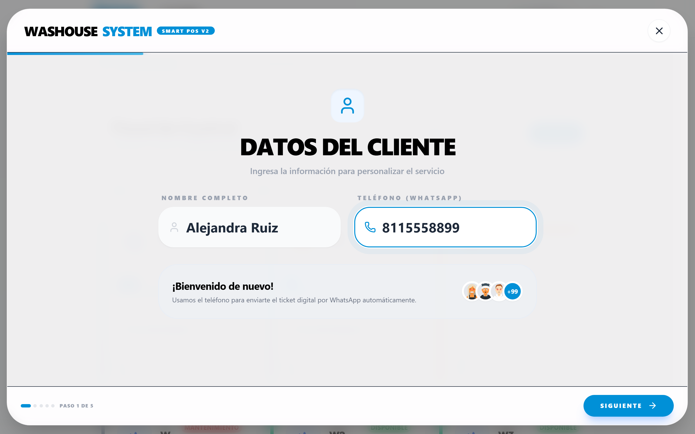

### Paso 2 — Servicios
- Busca por nombre o filtra por categoría: Lavado, Autoservicio, Especiales, Planchado, Compostura.
- Toca un servicio para agregarlo. Aparece en el **resumen de la derecha**, donde puedes subir o bajar cantidad y quitar renglones.
- Arriba a la derecha está el selector de equipo: **Mostrador** o la máquina específica. Solo lista máquinas disponibles.
- **Báscula:** si está conectada por USB, pulsa *Conectar Báscula* una vez; el peso en vivo se toma como cantidad al agregar un servicio por kilo. Si no hay báscula, escribe el peso a mano en el resumen.
- **Lavado y secado** agrega detergente y suavizante marcados *(Inc.)* en $0. No los borres: es lo que el cliente tiene incluido.

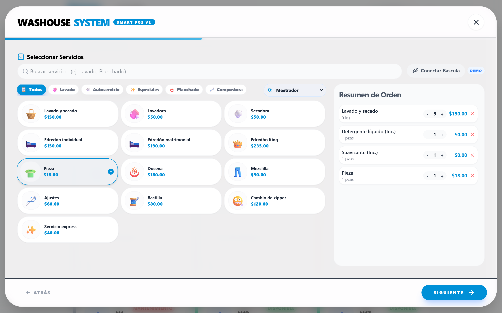

**Cómo cobra el sistema los servicios por peso** (importante, porque no es una regla lineal):
- *Lavadora* y *Lavado estándar*: cada **6 kg cuenta como una carga nueva**. Si el promedio por carga pasa de 5 kg, agrega el cargo extra por carga.
- Los demás servicios por kilo: precio base hasta 5 kg, y después se suma el extra por cada kilo adicional.

### Paso 3 — Insumos
Productos sueltos que se lleva el cliente (detergente, bolsa, gancho…). Si no lleva nada, pasa de largo.

> En Vista Hermosa las existencias **no se descuentan solas** al vender (ver la nota al final de `supabase/migrations/20260925_add_vista_hermosa_branch.sql`). Ajústalas a mano desde **Inventario** al cerrar.

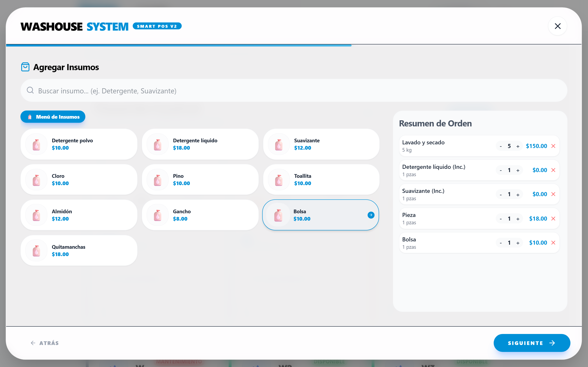

### Paso 4 — Pago y Confirmación
- **¿Requiere factura?** — el interruptor solo aparece si la sucursal cobra el IVA aparte. Actívalo **únicamente si el cliente pide factura**: ahí se le suma el IVA al total. Si no la pide, paga el precio de lista.
- **Monto recibido** — viene precargado con el total. Botones rápidos: *Anticipo 50%* y *Total 100%*.
- **Mínimo que el sistema acepta:**
  - Orden con máquina asignada → **100%**, no arranca el equipo con menos.
  - Orden de mostrador → **50%** de anticipo.
- **Método:** Efectivo o Tarjeta.
- Botón verde **Registrar Orden**.

Sin factura, el cliente paga el precio de lista:

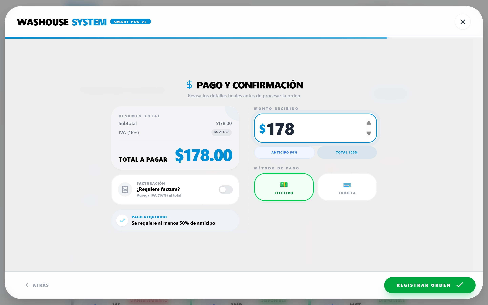

Con el interruptor de factura encendido, el mismo cobro suma el IVA:

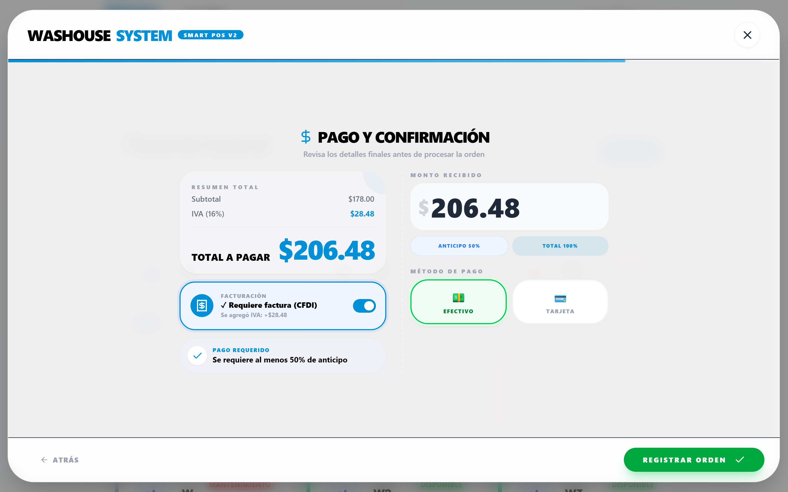

### Paso 5 — Listo
Aparece el **folio de la orden**. Desde ahí:
- **Imprimir Cliente** — el ticket que se lleva. Trae el folio y la dirección para solicitar factura.
- **Imprimir Negocio** — la copia que se queda con la prenda o en caja.
- **Enviar WhatsApp** — abre WhatsApp con el mensaje de confirmación ya escrito.

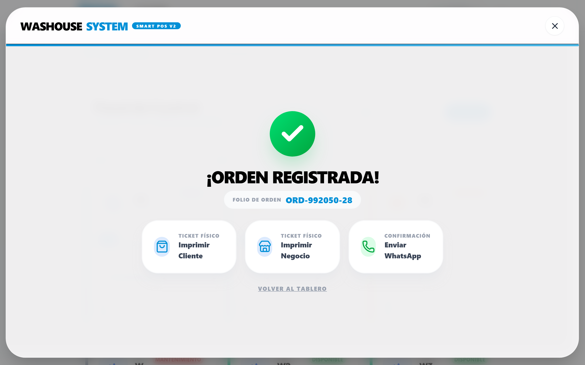

> Dile al cliente que **guarde el folio**. Es lo único con lo que puede pedir su factura después.

---

## 5. Servicios Programados — órdenes de encargo

Tablero de dos columnas: **Recibido → Terminado**

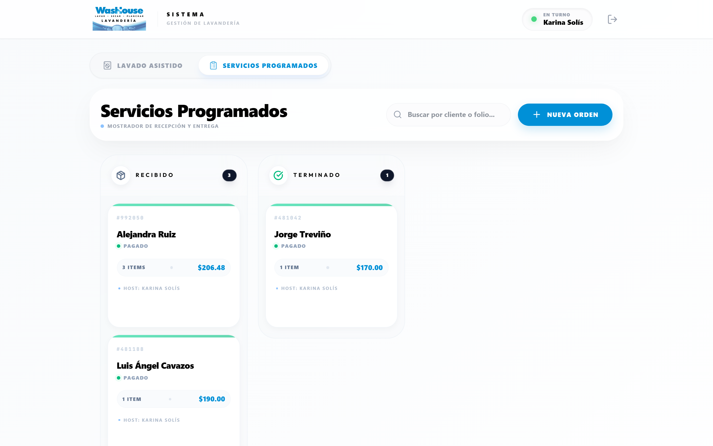

- Busca por nombre de cliente o por folio.
- Toca una tarjeta para ver el detalle completo.
- Para pasar una orden a **Terminado** el sistema pide confirmación.
- **Si la orden tiene saldo pendiente, se abre el cobro antes de dejarla pasar.** No se puede marcar terminada sin liquidar.
- Al quedar terminada, ofrece mandar el WhatsApp de "tu ropa ya está lista". Puedes elegir *Continuar sin avisar*.

---

## 6. Facturación

El cliente factura solo, desde su ticket: entra a **`/solicitar-factura`**, escribe el folio y captura RFC, razón social y correo. La solicitud le llega al administrador, que la timbra desde el panel.

Tu única responsabilidad en el mostrador: **preguntar si requiere factura antes de cobrar** y activar el interruptor en el paso 4. Si el cliente la pide después, el IVA ya no está cobrado y el ajuste lo resuelve administración.

---

## 7. Corte de turno

Botón de salida (↪) arriba a la derecha.

El sistema te muestra:

```
Fondo inicial  +  Ventas en efectivo  −  Gastos  =  Efectivo esperado en caja
```

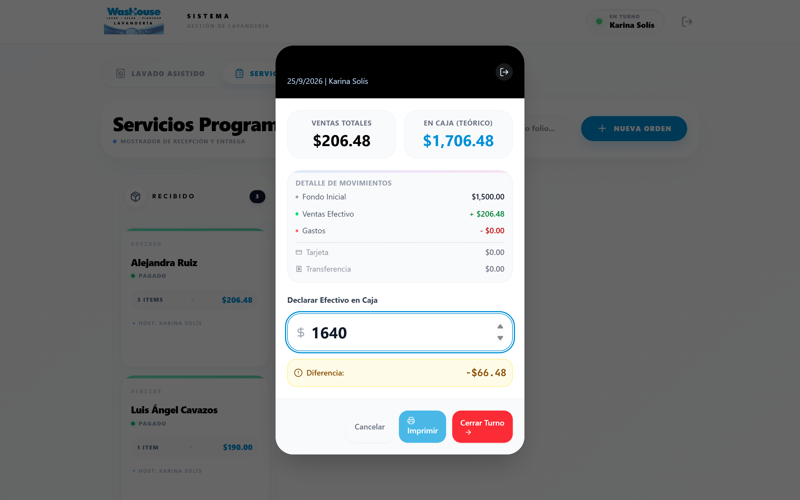

En el ejemplo: $1,500 de fondo más $206.48 de venta en efectivo dan $1,706.48 esperados. Se declararon $1,640, y el sistema marca la diferencia de −$66.48 en amarillo.

1. Cuenta el dinero físico y captúralo en **Declarar Efectivo en Caja**.
2. La **Diferencia** aparece al instante: verde si cuadra, amarillo si no.
3. **Imprimir** para dejar el comprobante del corte.
4. **Cerrar Turno** → confirma con **Sí, Cerrar Turno** (pide dos toques a propósito).

Las ventas con tarjeta se listan aparte y no cuentan para el efectivo esperado.

> **Regla de caja:** hoy la app **no tiene pantalla para registrar gastos**. Cualquier dinero que salga del cajón durante el turno aparecerá como faltante en el corte. No saques efectivo de caja sin autorización, y si pasa, anótalo y repórtalo al cerrar.

---

## 8. Problemas comunes

| Situación | Qué hacer |
|---|---|
| "Debes iniciar turno para operar las máquinas" | El turno está cerrado. Ábrelo desde la pantalla de identificación. |
| El PIN no es aceptado | Verifica que seleccionaste tu propio perfil. El PIN es de 4 dígitos. |
| No aparecen las máquinas de esta sucursal | El dispositivo está vinculado a otra sucursal. Lo corrige el administrador en Configuración → Este Dispositivo. |
| El ticket no se imprime | El navegador bloqueó la ventana emergente. Permite pop-ups para el sitio y vuelve a imprimir desde el detalle de la orden. |
| La báscula no conecta | Solo funciona en Chrome o Edge, con el cable conectado antes de abrir el navegador. Si falla, captura el peso a mano. |
| Un ciclo terminó antes de tiempo | Abre la tarjeta de la máquina y usa **Forzar Terminado**. |
| Se fue el internet | La app no guarda sin conexión. Anota las órdenes en papel y captúralas al volver la señal. |
| Se equivocó una orden ya registrada | El mostrador no puede borrar órdenes. Repórtalo a administración. |

---

## 9. Rutina del día

**Al abrir**
1. Identificarte y capturar el fondo de caja contado.
2. Revisar que ninguna máquina haya quedado en "Terminado" o "Mantenimiento" del día anterior.
3. Revisar inventario de insumos.

**Durante el día**
- Toda venta entra por el asistente, incluso la más pequeña. Lo que no se captura, no existe en el corte.
- Preguntar siempre: *¿requiere factura?*
- Liberar las máquinas solo cuando el cliente ya sacó la ropa.

**Al cerrar**
1. Pasar a Terminado las órdenes entregadas.
2. Contar efectivo y hacer el corte.
3. Imprimir el comprobante del corte y dejarlo con el dinero.
